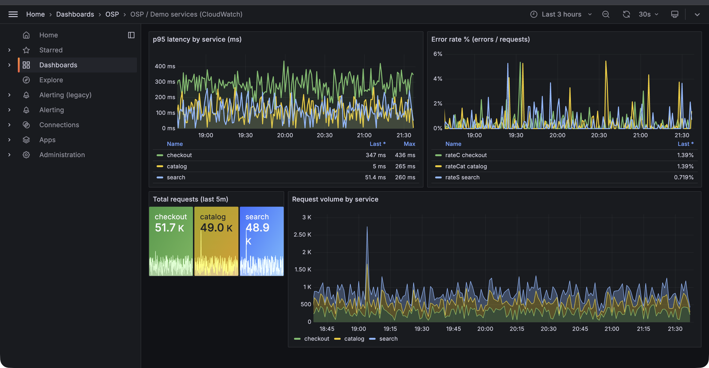
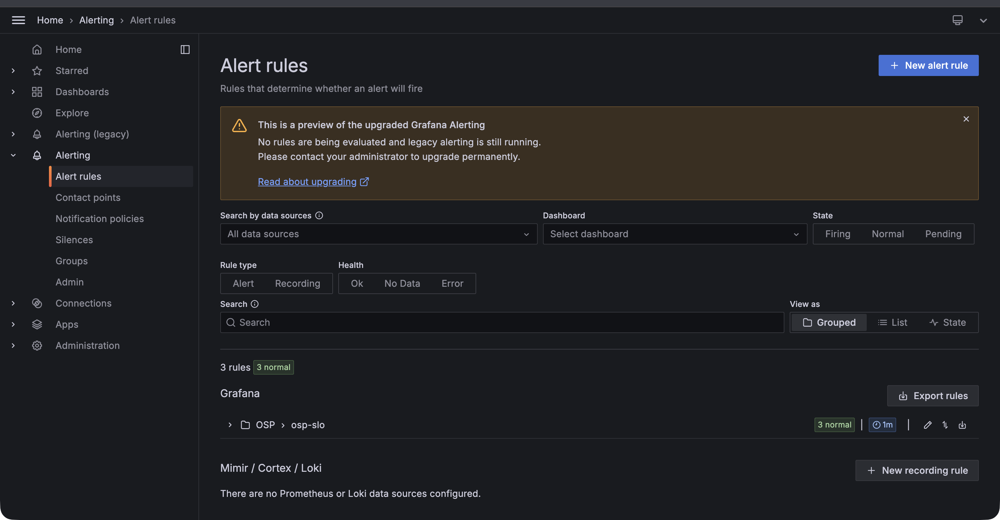
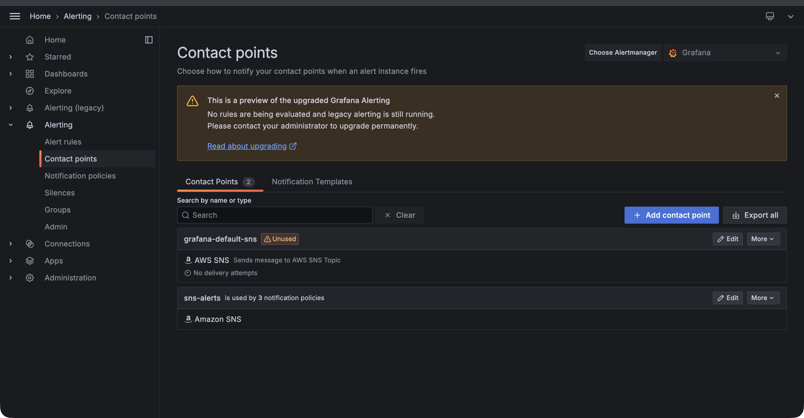
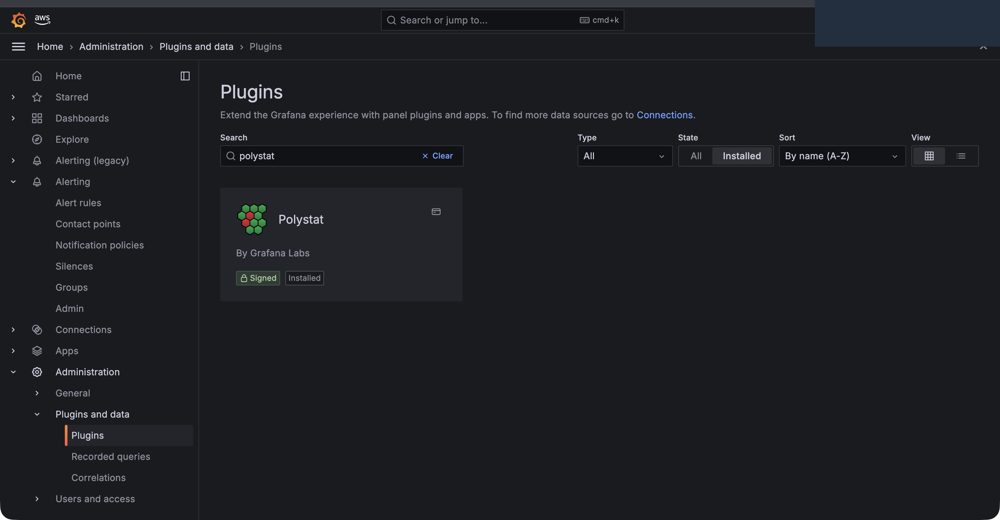
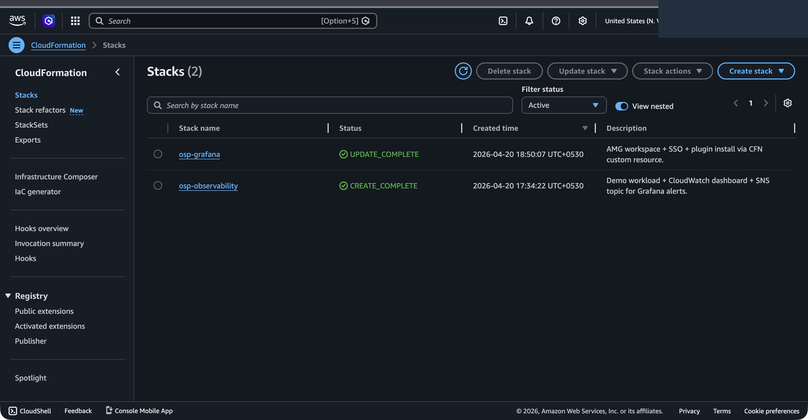
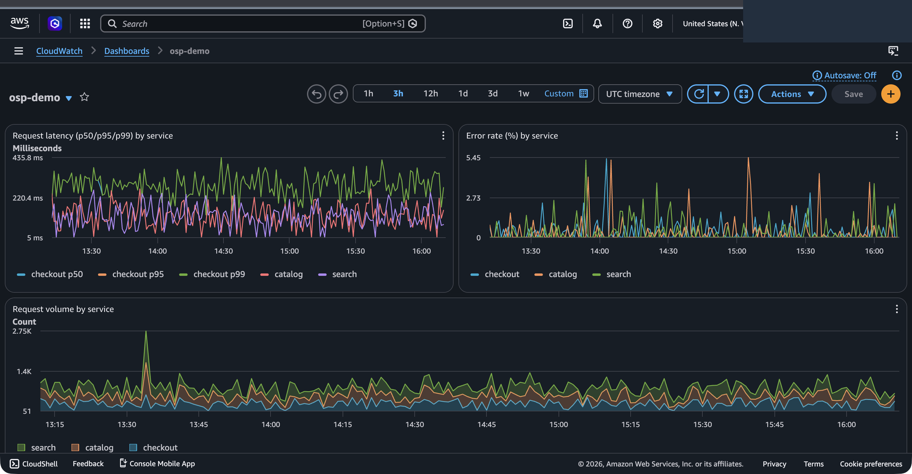
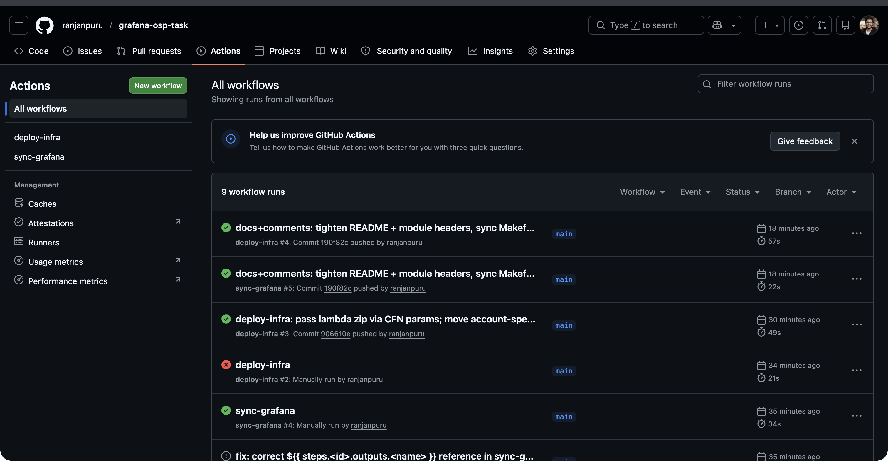

# grafana-osp-task

AMG + CloudWatch + SNS wired up end-to-end via CloudFormation and GitHub Actions.

## Screenshots

Grafana dashboard over CloudWatch metrics, auto-refreshing every 30s:



The three alert rules provisioned into the `OSP` folder by the sync workflow:



SNS contact point the notification policies route to (no static AWS creds -
the workspace role signs SNS calls with SigV4):



One of the plugins the CFN custom resource installed at stack-create time:



Both stacks deployed by `deploy-infra` - parameters fed from the committed
`dev.json` + GitHub Actions variables:



CloudWatch-native dashboard reading the same `osp/Demo` metrics:



GitHub Actions runs - OIDC auth into AWS, no static keys anywhere:



## What's in here

- **`cloudformation/`** - two stacks:
  - `observability.yaml` - SNS topic, a scheduled demo-workload Lambda that
    emits `osp/Demo` metrics every minute, and a CloudWatch dashboard over
    those metrics.
  - `grafana-workspace.yaml` - the AMG workspace (AWS_SSO auth, CloudWatch
    datasource, SNS notification destination, `PluginAdminEnabled`), plus a
    `Custom::GrafanaBootstrap` resource.
- **`lambda/grafana_custom_resource/`** - the handler behind that custom
  resource. On Create/Update it mints a short-lived admin service account on
  the workspace, installs the configured plugins via the Grafana HTTP API,
  assigns the IdC group as ADMIN, and deletes the SA before returning.
- **`grafana/`** - dashboard JSON, alert rules, SNS contact point,
  notification policy and templates. This is what gets pushed to the
  workspace by the sync workflow.
- **`.github/workflows/`** - two workflows:
  - `deploy-infra.yml` fires on `cloudformation/**` or `lambda/**` changes,
    packages the Lambda zip, uploads to S3, deploys both stacks.
  - `sync-grafana.yml` fires on `grafana/**` changes and runs
    `scripts/sync_grafana.py` against the workspace.

```
  users ──SSO──▶ AMG workspace ──CW DS──▶ CloudWatch ◀── osp-workload
                     │                        ▲
                     │ alert eval             │ metrics
                     ▼                        │ (1 min schedule)
                    SNS ──▶ email / etc.
```

## Config model

Only non-sensitive defaults are committed (`cloudformation/parameters/dev.json`:
namespace, workspace name, Grafana version, plugin list).

Account-specific stuff lives in GitHub Actions variables/secrets so the repo
stays clone-and-go for anyone else:

| where | key | what |
|---|---|---|
| `vars` | `AWS_REGION` | deploy region |
| `vars` | `ARTIFACTS_BUCKET` | S3 for the Lambda zip |
| `vars` | `ALERTS_EMAIL` | subscribed to the SNS topic |
| `vars` | `ADMIN_GROUP_ID` | IdC group to make workspace ADMIN |
| `secrets` | `AWS_DEPLOY_ROLE_ARN` | role the workflows assume via OIDC |

## Deploy via GitHub Actions

1. Create an IAM OIDC provider for `token.actions.githubusercontent.com`.
2. Create a role trusting the repo (`repo:<owner>/<name>:ref:refs/heads/main`)
   and attach the policies you want. For a sandbox: `PowerUserAccess` +
   `IAMFullAccess`.
3. Set the vars + secret above.
4. Push to `main`.

First full deploy is ~10 min; AMG workspace provisioning dominates.
Subsequent `sync-grafana` runs finish in ~30 s.

## Deploy locally

```bash
export AWS_PROFILE=my-sandbox AWS_REGION=us-east-1
export ARTIFACTS_BUCKET=my-bucket
export ALERTS_EMAIL=me@example.com
export ADMIN_GROUP_ID=<idc group uuid>

make bucket
make deploy   # packages lambda, deploys both stacks
make sync     # pushes dashboards/alerts from grafana/
```

## Sharp edges worth flagging

- **AMG ships new workspaces with unified alerting OFF.** `CreateWorkspace`
  via CFN sets `unifiedAlerting.enabled: false` by default. Provisioned
  ngalert rules show up in the UI, appear healthy, and never evaluate
  (`lastEvaluation: 0001-01-01T00:00:00Z`). Fix: `UpdateWorkspaceConfiguration`
  to flip the flag, which restarts the workspace. The custom resource does
  this before anything else on create. If you hit this on an already-deployed
  workspace, run:
  ```
  aws grafana update-workspace-configuration --workspace-id <id> \
    --configuration '{"unifiedAlerting":{"enabled":true},"plugins":{"pluginAdminEnabled":true}}'
  ```
- **IdC managed-app race.** After the workspace goes ACTIVE, AMG takes a few
  seconds to register a managed application in IAM Identity Center.
  `grafana:UpdatePermissions` 403s with `Unable to update users in managed
  application` until that finishes. Custom resource retries for ~2 min; if
  it still can't assign, it logs and moves on rather than rolling back the
  whole workspace. I'd rather re-run `UpdatePermissions` than lose a 6-min
  provision.
- **Plugins are unpinned.** Installs the latest for a given plugin id. AMG
  keeps plugin versions in sync with the Grafana channel anyway; pass an
  explicit `version` in the custom resource props if you need to pin.
- **Deprecated plugin ids.** Some classic plugin ids like
  `grafana-piechart-panel` were merged into core or retired. Install returns
  404, which we tolerate - one typo shouldn't roll back a workspace.
- **Alert rule prune.** Sync upserts by UID. If you rename a rule without
  keeping the UID, the old one is orphaned - either reuse the UID or clean
  up manually. Haven't bothered adding a prune pass yet.
- **SNS on resolve.** Grafana fires once on alert and once on resolve. If
  this gets wired to Slack later, put a filter lambda in between or the
  channel will get noisy.

